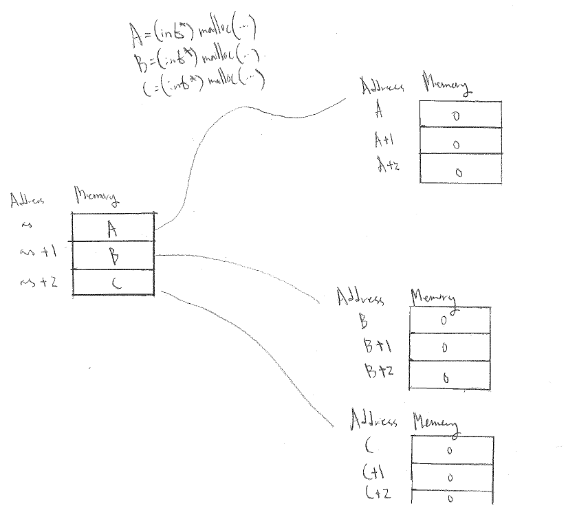
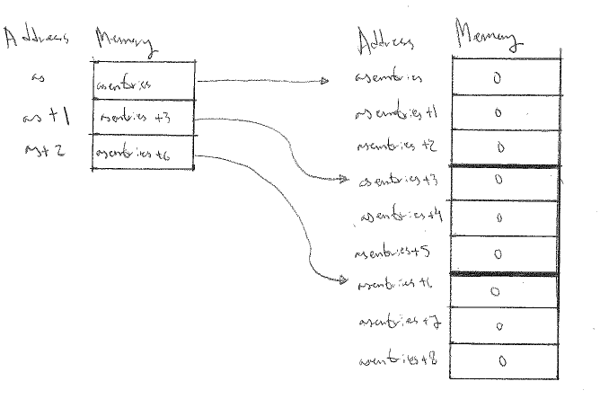

# Assignment report 0

## Installing and testing FLINT and Arb
To make sure that we compile to the native architecture of Gantenbein, we use the flag `-march=native` with `gcc`. We also make sure that we compile according to the C11 standard by passing the flag `-std=c11`. Finally, to make sure that Flint and Arb gets installed to `local_flint` and `local_arb` respectively, we use the `--prefix` option with `./configure`. I. e., we run

> `./configure --prefix=/home/tobias/local_flint CFLAGS='-std=c11 -march=native'`

The flag `-march=native` does more than just compile for 64-bit or 32-bit. With this flag

> `gcc` will attempt to detect the processor and automatically set appropriate flags for it

see [here](https://wiki.gentoo.org/wiki/GCC_optimization#-march). Also, when building Arb, we need to specify where Flint is, and we do this by passing `--with-flint=/home/tobias/local_flint` to `./configure` in addition to the above. After the configure, just run `make && make install` and `make check` if you also want to run the tests.

To make sure all libraries and headers can be found, we need to export `/home/tobias/local_flint` and `/home/tobias/local_arb` to `LD_LIBRARY_PATH` so that the shared libraries can be found. This can be done be executing `export LD_LIBRARY_PATH=$LD_LIBRARY_PATH:<path to library>` for both `/home/tobias/local_flint` and `/home/tobias/local_arb`. See [here](https://stackoverflow.com/questions/32550654/libarb-so-cannot-open-shared-object-file-no-such-file-or-directory).

If you'd in addition to the above would like to run some proper tests, you could copy `/arb-2.14.0/examples/poly_roots.c` to some appropriate place and write a `makefile` on the following form

~~~ make
all : poly_roots

poly_roots : poly_roots.c
        gcc -o poly_roots -L/home/tobias/local_flint/lib -L/home/tobias/local_arb/lib -I/home/tobias/local_flint/include -I/home/tobias/local_arb/include poly_roots.c -lflint -larb
~~~

We can now run `poly_roots` as follows

~~~ console
[tobias@gantenbein arb_example]$ ./poly_roots 
poly_roots [-refine d] [-print d] <poly>

Isolates all the complex roots of a polynomial with integer coefficients.

If -refine d is passed, the roots are refined to a relative tolerance
better than 10^(-d). By default, the roots are only computed to sufficient
accuracy to isolate them. The refinement is not currently done efficiently.

If -print d is passed, the computed roots are printed to d decimals.
By default, the roots are not printed.

The polynomial can be specified by passing the following as <poly>:

a <n>          Easy polynomial 1 + 2x + ... + (n+1)x^n
t <n>          Chebyshev polynomial T_n
u <n>          Chebyshev polynomial U_n
p <n>          Legendre polynomial P_n
c <n>          Cyclotomic polynomial Phi_n
s <n>          Swinnerton-Dyer polynomial S_n
b <n>          Bernoulli polynomial B_n
w <n>          Wilkinson polynomial W_n
e <n>          Taylor series of exp(x) truncated to degree n
m <n> <m>      The Mignotte-like polynomial x^n + (100x+1)^m, n > m
coeffs <c0 c1 ... cn>        c0 + c1 x + ... + cn x^n

Concatenate to multiply polynomials, e.g.: p 5 t 6 coeffs 1 2 3
for P_5(x)*T_6(x)*(1+2x+3x^2)
~~~

So, here's an example output

~~~ console
[tobias@gantenbein arb_example]$ ./poly_roots a 1 -print 10
computing squarefree factorization...
cpu/wall(s): 0 0
1 roots with multiplicity 1
searching for 1 roots, 1 deflated
prec=32: 1 isolated roots | cpu/wall(s): 0 0
done!
-0.5000000000
cpu/wall(s): 0.001 0.001
~~~

##Basic C programming

My code can be found in `./basic_c_programming/`. We compile with optimization level 1 by passing the flag `-O1` to `gcc`.

###Stack and heap allocation
The program fails with a segfault when `SIZE` is 2500000. How can we explain this theoretically? Using the command `ulimit -s` we can get the maximum stack size (see e. g. [here](https://ss64.com/bash/ulimit.html)) in terms of KiB. In our case, we get that the maximum stack size is 8192 KiB.

In addition, the following mini program prints the size of an `int` in bytes.

~~~ c
#include <stdio.h>

void main(){
        printf("%d bytes\n",sizeof(int));
}
~~~

and we see that it is 4 bytes. Hence the program should segfault precisely when

$$
\begin{align*}
s>\frac{8192\cdot 1024}{4}=2097152
\end{align*}
$$

where $$s$$ is `SIZE`. This seems to be roughly the case, when $$s=2094200$$ the program segfaults most of the time, but not always. As $$s$$ increases above this, segfaults become more and more frequent. The reason for why it segfaults before our prediction, is probably due to the stack already being partly occupied.

It's indeed the case, that when allocating on the heap using `malloc`, the program doesn't segfault for the above sizes. It's hard to find out the precise limit for when we'd segfault while allocating on the heap. Indeed, `ulimit -a` returns (among other data)

> `max memory size         (kbytes, -m) unlimited`

###Memory fragmentation

Below I have included the source code for two programs that initializes a square matrix of size 10 containing `int` entries. In the first program, the memory is allocated in ad-hoc way; and in the second program, it is allocated in a contiguous block.

The comments in the code explain the meaning of all variables, and below the code I have included a visualization of the memory is allocated in both cases.

~~~ c
//Fragmented
#include <stdio.h>
#include <stdlib.h>

#define SIZE 10
void main(){
	//Fragmented allocation
	int ** as = (int**) malloc(sizeof(int*) * SIZE); //Allocate memory for SIZE many pointers to integers. Return a pointer to the first of these. The input is in bytes.
	for ( size_t ix = 0; ix < SIZE; ++ix ){
  		as[ix] = (int*) malloc(sizeof(int) * SIZE);  //Allocate memory for SIZE many integers. Return a pointer to the first of these.
	}

	for ( size_t ix = 0; ix < SIZE; ++ix ){
  		for ( size_t jx = 0; jx < SIZE; ++jx ){
    			as[ix][jx] = 0; //Same as "*(as[ix] + jx)=0" which is the same as "*(*(as + ix) + jx)=0". The meaning is, store the value zero at the address "*(as + ix) + jx".
		}
	}

	printf("%d\n", as[0][0]);

	for ( size_t ix = 0; ix < SIZE; ++ix ){
    		free(as[ix]); //Free the memory containing the integers
	}
	free(as); //Free the memory containing the pointers.
}
~~~

N. B. Recall that the value of a pointer is an address in memory.

In the visualization below, we assume that `SIZE` is 3.

~~~ c
//Contiguous
#include <stdio.h>
#include <stdlib.h>

#define SIZE 10
void main(){
	int * asentries = (int*) malloc(sizeof(int) * SIZE*SIZE); //Allocate memory for SIZE*SIZE many integers. Return a pointer to the first of these.
	int ** as = (int**) malloc(sizeof(int*) * SIZE); //Allocate memory for SIZE many pointers to integers. Return a pointer to the first of these.
	for ( size_t ix = 0, jx = 0; ix < SIZE; ++ix, jx+=SIZE ){
  		as[ix] = asentries + jx; //Store the address "asentries+jx" at the address "as+ix". Note that jx increases in multiples of SIZE, so that its value is in fact ix*SIZE.
	}

	for ( size_t ix = 0; ix < SIZE; ++ix ){
  		for ( size_t jx = 0; jx < SIZE; ++jx ){
    			as[ix][jx] = 0; //Store the value zero at the address *(as+ix)+jx, i. e. at the address asentries+ix*SIZE+jx.
		}
	}

	printf("%d\n", as[0][0]);

	free(as); //Free the memory containing the pointers.
	free(asentries); //Free the memory containing the integers.
}
~~~

Again we assume `SIZE` to be 3 in the visualization below.

Note that with some basic arithmetic it's unnecessary to store the `as` array. That would've saved us $$80$$ bytes :)

###Writing to files

Using contiguous allocation, I've the following program.

~~~ c
include <stdio.h>
#include <string.h>
#include <stdlib.h>

#define SIZE 10

void main(){
        FILE * matrixfile;
        matrixfile=fopen("matrix.txt","w"); //Open ./matrix.txt for writing
        int * asentries = (int*)malloc(sizeof(int)*SIZE*SIZE);
        int ** as = (int**)malloc(sizeof(int*)*SIZE); //Just for the comfort of double indices. Not in fact needed.
        //Don't forget to initialize! Otherwise we'll segfault.
        for (size_t ix=0, jx=0; ix<SIZE; ++ix,jx+=SIZE)
                as[ix]=asentries+jx;

        for (size_t ix=0; ix<SIZE; ++ix){
                for (size_t jx=0; jx<SIZE; ++jx){
                        scanf("%d",&as[ix][jx]);
                        fprintf(matrixfile,"%d ",as[ix][jx]); //Put as[ix][jx] in the buffer
                }
                printf("changing row\n");
                fprintf(matrixfile,"\n"); //Put as[ix][jx] in the buffer
                fflush(matrixfile); //Write what's in the buffer to file
        }
        fclose(matrixfile); //Close the file
        matrixfile=fopen("matrix.txt","r"); //Open it again, for reading
        int * current =(int*)malloc(sizeof(int)); //Allocate some memory for a variable to store the current value being read. Not necessary to have it on the heap!
        int areequal = 0;
        for (size_t ix=0; ix<SIZE; ++ix){
                for (size_t jx=0; jx<SIZE; ++jx){
                        fscanf(matrixfile,"%d",current);
                        areequal = *current == as[ix][jx];
                        printf(areequal ? "are equal\n" : "aren't equal\n");
                }
        }
        fclose(matrixfile);
        free(as);
        free(asentries);
}
~~~

Non-contiguously, it looks similar. The point is however that there is no difference in performance using contiguous or non-contiguous allocation.

###Parsing command line arguments

In the below program I'm assuming an "intelligent" user, i. e. one who only inputs valid arguments.

~~~ c
#include <stdio.h>
#include <string.h>
#include <stdlib.h>

void main(int argc, char *argv[]){
        char cmp[] = "-a";
        int ais = 0;
        int bis = 0;
        if (strcmp(argv[1],cmp) == 0){
                ais=strtol(argv[2],NULL,10);
                bis=strtol(argv[4],NULL,10);
        } else {
                ais=strtol(argv[4],NULL,10);
                bis=strtol(argv[2],NULL,10);
        }
        printf("A is %d and B is %d\n",ais,bis);
}
~~~

Should one wish to, it'd be pretty easy to implement some error management into the above, but in my opinion that's unnecessary.
