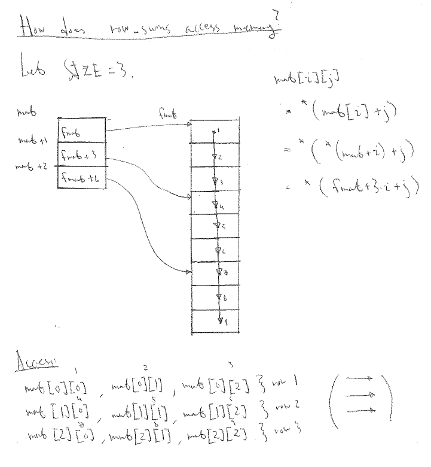
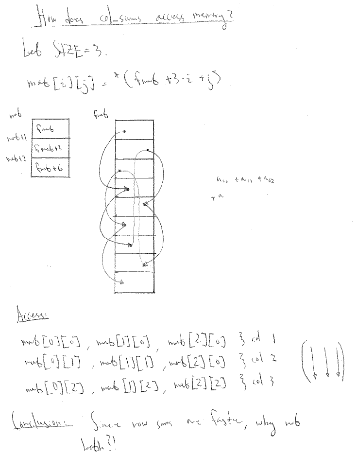

# Assignment report 1

What follows is a report of Tobias Magnusson and Henrik Imbergs solution of assignment 1.

## Time

In this part we implement a program consisting of nested loops. In the inner loop, we compute the sum of the first billion integers, and in the outer loop we write the sum to `stdout` and time every iteration. We also, for good measure, time the total and average execution time.

~~~C
void main(int argc, char *argv[]){
        struct timespec start,stop,absstart,absstop;
        long S=0;
        int reps=strtol(argv[1],NULL,10);
        long double elapsed;
        timespec_get(&absstart, TIME_UTC);
        for(size_t n=0; n<reps; ++n){
                timespec_get(&start, TIME_UTC);
                for(size_t i=0; i<SIZE; ++i)
                        S+=i;
                timespec_get(&stop, TIME_UTC);
                printf("Result: %ld\n",S);
                elapsed=(stop.tv_sec+1.0e-9*stop.tv_nsec)-(start.tv_sec+1.0e-9*start.tv_nsec);
                printf("Took %.15Lf secs\n",elapsed);
                S=0;
        }
        timespec_get(&absstop, TIME_UTC);
        elapsed=(absstop.tv_sec+1.0e-9*absstop.tv_nsec)-(absstart.tv_sec+1.0e-9*absstart.tv_nsec);
        printf("Total time %.15Lf secs\n",elapsed);
        printf("Average time %.15Lf secs\n",elapsed/reps);
        exit(0); //Need to return stuff, if you don't return 0 make will assume error
        //Returning 1 will make (or bash) not run stuff afterwards
}
~~~

We compile this program with all possible optimization levels and generate assembler code. See the `makefile` below.

~~~make
.PHONY : all

ARG=3

all : opt0 opt1 opt2 opt3 opts optg

opt0 : bigsum.c
        gcc -S -O0 bigsum.c -o bigsum_opt0.s
        gcc -O0 bigsum.c -o bigsum_opt0

opt1 : bigsum.c
        gcc -S -O1 bigsum.c -o bigsum_opt1.s
        gcc -O1 bigsum.c -o bigsum_opt1

opt2 : bigsum.c
        gcc -S -O2 bigsum.c -o bigsum_opt2.s
        gcc -O2 bigsum.c -o bigsum_opt2

opt3 : bigsum.c
        gcc -S -O3 bigsum.c -o bigsum_opt3.s
        gcc -O3 bigsum.c -o bigsum_opt3

opts : bigsum.c
        gcc -S -Os bigsum.c -o bigsum_opts.s
        gcc -Os bigsum.c -o bigsum_opts

optg : bigsum.c
        gcc -S -Og bigsum.c -o bigsum_optg.s
        gcc -Og bigsum.c -o bigsum_optg
clean :
        rm -f bigsum_*

check :
        ./bigsum_opt0 $(ARG)
        ./bigsum_opt1 $(ARG)
        ./bigsum_opt2 $(ARG)
        ./bigsum_opt3 $(ARG)
        ./bigsum_opts $(ARG)
        ./bigsum_optg $(ARG)
~~~

Running `make check` we may get something along the lines of what follows below.

~~~
./bigsum_opt0 3
Result: 499999999500000000
Took 1.713405370712280 secs
Result: 499999999500000000
Took 1.703644275665283 secs
Result: 499999999500000000
Took 1.702723503112793 secs
Total time 5.119848489761353 secs
Average time 1.706616163253784 secs
./bigsum_opt1 3
Result: 499999999500000000
Took 0.300299644470215 secs
Result: 499999999500000000
Took 0.287335634231567 secs
Result: 499999999500000000
Took 0.287215232849121 secs
Total time 0.874917984008789 secs
Average time 0.291639328002930 secs
./bigsum_opt2 3
Result: 499999999500000000
Took 0.000000000000000 secs
Result: 499999999500000000
Took 0.000000238418579 secs
Result: 499999999500000000
Took 0.000000000000000 secs
Total time 0.000106811523438 secs
Average time 0.000035603841146 secs
./bigsum_opt3 3
Result: 499999999500000000
Took 0.000000000000000 secs
Result: 499999999500000000
Took 0.000000000000000 secs
Result: 499999999500000000
Took 0.000000000000000 secs
Total time 0.000063896179199 secs
Average time 0.000021298726400 secs
./bigsum_opts 3
Result: 499999999500000000
Took 0.000000238418579 secs
Result: 499999999500000000
Took 0.000000000000000 secs
Result: 499999999500000000
Took 0.000000000000000 secs
Total time 0.000174522399902 secs
Average time 0.000058174133301 secs
./bigsum_optg 3
Result: 499999999500000000
Took 0.580969810485840 secs
Result: 499999999500000000
Took 0.574371814727783 secs
Result: 499999999500000000
Took 0.574378967285156 secs
Total time 1.729788541793823 secs
Average time 0.576596180597941 secs
~~~

We see that on average `-O3` is fastest. Note also that for `-O2`, `-O3`, and `-Os`, we often get individual loop times equal to zero -- let's get back to this later. Ordering the optimization levels by average execution time (of the program) we get

1. `-O3` with 0.000021298726400 seconds
2. `-O2` with 0.000035603841146 seconds
3. `-Os` with 0.000058174133301 seconds
4. `-O1` with 0.291639328002930 seconds
5. `-Og` with 0.576596180597941 seconds
6. `-O0` with 1.706616163253784 seconds

Let's compare this result with the assembler code. We first list the sizes (in bytes).

~~~bash
[tobias@gantenbein time]$ ls -lS *.s
-rw-rw-r--. 1 tobias tobias 2646 20 sep 18.27 bigsum_opt2.s
-rw-rw-r--. 1 tobias tobias 2646 20 sep 18.27 bigsum_opt3.s
-rw-rw-r--. 1 tobias tobias 2630 20 sep 18.27 bigsum_opt0.s
-rw-rw-r--. 1 tobias tobias 2537 20 sep 18.27 bigsum_optg.s
-rw-rw-r--. 1 tobias tobias 2491 20 sep 18.27 bigsum_opt1.s
-rw-rw-r--. 1 tobias tobias 2362 20 sep 18.27 bigsum_opts.s
~~~

This corresponds well with what is written in the `gcc` [documentation](https://gcc.gnu.org/onlinedocs/gcc-8.2.0/gcc/Optimize-Options.html#Optimize-Options). For example `-Os` optimizes for code size, and indeed `bigsum_opts.s` is smallest.

Let's delve a bit deeper into the actual timing, by compiling with the debug flag `-g` and then using `gdb`. Run

~~~bash
[tobias@gantenbein time]$ gcc -O3 -g bigsum.c -o bigsum_opt3_debug
~~~

and then

~~~bash
[tobias@gantenbein time]$ gdb -tui bigsum_opt3_debug
~~~

In `gdb`, we can then run

~~~bash
(gdb) layout split
(gdb) break main
Breakpoint 1 at 0x400500: file bigsum.c, line 10.
(gdb)
~~~

We now get an **extraordinarily** nice view of what is being executed -- both in the assembler code and in the actual C code. Running `run 3` and stepping instruction-wise a few times we see the precise reason why `-O3` is so fast!

~~~
   ┌──bigsum.c─────────────────────────────────────────────────────────────────────────────────────────┐
B+ │10              int reps=strtol(argv[1],NULL,10);                                                  │
   │11              long double elapsed;                                                               │
   │12              timespec_get(&absstart, TIME_UTC);                                                 │
  >│13              for(size_t n=0; n<reps; ++n){                                                      │
   │14                      timespec_get(&start, TIME_UTC);                                            │
   │15                      for(size_t i=0; i<SIZE; ++i)                                               │
   │16                              S+=i;                                                              │
   │17                      timespec_get(&stop, TIME_UTC);                                             │
   │18                      printf("Result: %ld\n",S);                                                 │
   │19                      elapsed=(stop.tv_sec+1.0e-9*stop.tv_nsec)-(start.tv_sec+1.0e-9*start.tv_nse│
   │20                      printf("Took %.15Lf secs\n",elapsed);                                      │
   │21                      S=0;                                                                       │
   │22              }                                                                                  │
   │23              timespec_get(&absstop, TIME_UTC);                                                  │
   │24              elapsed=(absstop.tv_sec+1.0e-9*absstop.tv_nsec)-(absstart.tv_sec+1.0e-9*absstart.tv│
   │25              printf("Total time %.15Lf secs\n",elapsed);                                        │
   │26              printf("Average time %.15Lf secs\n",elapsed/reps);                                 │
   │27              exit(0); //Need to return stuff, if you don't return 0 make will assume error      │
   │28              //Returning 1 will make (or bash) not run stuff afterwards                         │
   ┌───────────────────────────────────────────────────────────────────────────────────────────────────┐
   │0x40051d <main+29>      lea    0x40(%rsp),%rdi                                                     │
   │0x400522 <main+34>      mov    %rax,%rbp                                                           │
   │0x400525 <main+37>      mov    %eax,0x1c(%rsp)                                                     │
   │0x400529 <main+41>      callq  0x4004c0 <timespec_get@plt>                                         │
   │0x40052e <main+46>      movslq %ebp,%rbp                                                           │
   │0x400531 <main+49>      test   %rbp,%rbp                                                           │
   │0x400534 <main+52>      je     0x400693 <main+403>                                                 │
   │0x40053a <main+58>      movsd  0x336(%rip),%xmm6        # 0x400878                                 │
   │0x400542 <main+66>      xor    %ebx,%ebx                                                           │
  >│0x400544 <main+68>      movabs $0x6f05b59b5e49b00,%r12                                             │
   │0x40054e <main+78>      movsd  %xmm6,0x10(%rsp)                                                    │
   │0x400554 <main+84>      lea    0x20(%rsp),%rdi                                                     │
   │0x400559 <main+89>      mov    $0x1,%esi                                                           │
   │0x40055e <main+94>      add    $0x1,%rbx                                                           │
   │0x400562 <main+98>      callq  0x4004c0 <timespec_get@plt>                                         │
   │0x400567 <main+103>     lea    0x30(%rsp),%rdi                                                     │
   │0x40056c <main+108>     mov    $0x1,%esi                                                           │
   │0x400571 <main+113>     callq  0x4004c0 <timespec_get@plt>                                         │
   │0x400576 <main+118>     mov    %r12,%rsi                                                           │
   └───────────────────────────────────────────────────────────────────────────────────────────────────┘
native process 11775 In: main                                                        L13   PC: 0x400544 

(gdb) b	main
Breakpoint 1 at 0x400500: file bigsum.c, line 10.
(gdb) run 3
Starting program: /home/tobias/GIT/HPC/assignment1/time/bigsum_opt3_debug 3
Missing separate debuginfos, use: dnf debuginfo-install glibc-2.27-30.fc28.x86_64

Breakpoint 1, main (argc=2, argv=0x7fffffffdf68) at bigsum.c:10
(gdb) n
(gdb) ni
(gdb) ni
(gdb) ni
(gdb) ni
(gdb) ni
(gdb) ni
(gdb) 
~~~

Of special importance is the instruction at `0x400544 <main+68>`.

~~~asm
movabs $0x6f05b59b5e49b00,%r12
~~~

Converting `0x6f05b59b5e49b00` to `long`, we get 499999999500000000. But this is just $$\frac{(10^9-1)\cdot 10^9}{2}$$, i. e. the sum of the first billion integers. The compiler precomputes the sum!

This does indeed not happen when compiling with `-O0`, see below.

~~~
   ┌──bigsum.c──────────────────────────────────────────────────────┐
   │7       void main(int argc, char *argv[]){                      │
   │8               struct timespec start,stop,absstart,absstop;    │
   │9               long S=0;                                       │
   │10              int reps=strtol(argv[1],NULL,10);               │
   │11              long double elapsed;                            │
   │12              timespec_get(&absstart, TIME_UTC);              │
   │13              for(size_t n=0; n<reps; ++n){                   │
   │14                      timespec_get(&start, TIME_UTC);         │
B+ │15                      for(size_t i=0; i<SIZE; ++i)            │
  >│16                              S+=i;                           │
   │17                      timespec_get(&stop, TIME_UTC);          │
   │18                      printf("Result: %ld\n",S);              │
   │19                      elapsed=(stop.tv_sec+1.0e-9*stop.tv_nsec│
   │20                      printf("Took %.15Lf secs\n",elapsed);   │
   │21                      S=0;                                    │
   │22              }                                               │
   │23              timespec_get(&absstop, TIME_UTC);               │
   │24              elapsed=(absstop.tv_sec+1.0e-9*absstop.tv_nsec)-│
   │25              printf("Total time %.15Lf secs\n",elapsed);     │
   ┌────────────────────────────────────────────────────────────────┐
   │0x400629 <main+67>      mov    %rax,%rdi                        │
   │0x40062c <main+70>      callq  0x4004c0 <timespec_get@plt>      │
   │0x400631 <main+75>      movq   $0x0,-0x10(%rbp)                 │
   │0x400639 <main+83>      jmpq   0x40071d <main+311>              │
   │0x40063e <main+88>      lea    -0x40(%rbp),%rax                 │
   │0x400642 <main+92>      mov    $0x1,%esi                        │
   │0x400647 <main+97>      mov    %rax,%rdi                        │
   │0x40064a <main+100>     callq  0x4004c0 <timespec_get@plt>      │
B+ │0x40064f <main+105>     movq   $0x0,-0x18(%rbp)                 │
   │0x400657 <main+113>     jmp    0x40066d <main+135>              │
  >│0x400659 <main+115>     mov    -0x8(%rbp),%rdx                  │
   │0x40065d <main+119>     mov    -0x18(%rbp),%rax                 │
   │0x400661 <main+123>     add    %rdx,%rax                        │
   │0x400664 <main+126>     mov    %rax,-0x8(%rbp)                  │
   │0x400668 <main+130>     addq   $0x1,-0x18(%rbp)                 │
   │0x40066d <main+135>     cmpq   $0x3b9ac9ff,-0x18(%rbp)          │
   │0x400675 <main+143>     jbe    0x400659 <main+115>              │
   │0x400677 <main+145>     lea    -0x50(%rbp),%rax                 │
   │0x40067b <main+149>     mov    $0x1,%esi                        │
   └────────────────────────────────────────────────────────────────┘
native process 12272 In: main                     L16   PC: 0x400659 

(gdb) b	15
Breakpoint 1 at 0x40064f: file bigsum.c, line 15.
(gdb) run 3
Starting program: /home/tobias/GIT/HPC/assignment1/time/bigsum_opt0_d
ebug 3
Missing separate debuginfos, use: dnf debuginfo-install glibc-2.27-30
.fc28.x86_64

Breakpoint 1, main (argc=2, argv=0x7fffffffdf68) at bigsum.c:15
(gdb) ni
(gdb) ni
(gdb) ni
(gdb) ni
(gdb)
~~~

Here we see that indeed the `for` loop is being executed. See the commented code below.

~~~
0x40064f <main+105>     movq   $0x0,-0x18(%rbp) //initialize i to 0
0x400657 <main+113>     jmp    0x40066d <main+135> //jump to the comparison
0x400659 <main+115>     mov    -0x8(%rbp),%rdx //loop: put S in %rdx
0x40065d <main+119>     mov    -0x18(%rbp),%rax //put i in %rax
0x400661 <main+123>     add    %rdx,%rax //add %rdx and %rax and store result in %rax
0x400664 <main+126>     mov    %rax,-0x8(%rbp) //move %rax to S
0x400668 <main+130>     addq   $0x1,-0x18(%rbp) //add 1 to i
0x40066d <main+135>     cmpq   $0x3b9ac9ff,-0x18(%rbp) //comparison: comparing i with 0x3b9ac9ff=999999999
0x400675 <main+143>     jbe    0x400659 <main+115> //jump to the loop if below or equal
~~~

I don't have time to look at the other assembler code in detail, even if it'd be delightful.

## Inlining

In this part we investigate the effects of automatic inlining. We do this by implementing a function `mul_cpx` that computes the sum of two complex numbers, in three different ways.

1. By putting `mul_cpx` in the same file as `main`, but not inlined. Call this variant 1.
2. By putting `mul_cpx` in a different `.c` file from `main`, and then importing it. Call this variant 2.
3. By inlining `mul_cpx` manually wherever it is called. Call this variant 3.

To measure we execute the following code (or a minor variation thereof).

~~~C
struct timespec start,stop;
double * ares = (double *) malloc(sizeof(double)*SIZE);
double * aims = (double *) malloc(sizeof(double)*SIZE);
double * bres = (double *) malloc(sizeof(double)*SIZE);
double * bims = (double *) malloc(sizeof(double)*SIZE);
double * cres = (double *) malloc(sizeof(double)*SIZE);
double * cims = (double *) malloc(sizeof(double)*SIZE);

long double elapsed;

timespec_get(&start, TIME_UTC);
//Generating entries for b and c
for (size_t i=0; i<SIZE; ++i){
	*(bres + i) = 1;
	*(bims + i) = 1;
	*(cres + i) = 1;
	*(cims + i) = 1;
}
timespec_get(&stop, TIME_UTC);
elapsed=(stop.tv_sec+1.0e-9*stop.tv_nsec)-(start.tv_sec+1.0e-9*start.tv_nsec);
printf("Took %Lf10 secs to generate.\n",elapsed);
timespec_get(&start, TIME_UTC);
for (size_t i=0; i<SIZE; ++i)
	mul_cpx_TYPE(ares+i, aims+i, bres+i, bims+i, cres+i, cims+i); //TYPE is pseudo
timespec_get(&stop, TIME_UTC);
elapsed=(stop.tv_sec+1.0e-9*stop.tv_nsec)-(start.tv_sec+1.0e-9*start.tv_nsec);
printf("Took %Lf10 secs to compute.\n",elapsed);
~~~

where `TYPE` can be either `mainfile` or `separatefile`, depending on whether we measure variant 1, 2, or 3.

In order to make sure that variant 2 doesn't get inlined, construct a `makefile` along the lines of the following.

~~~make
CFLAGS=-std=c11 -march=native -O2
TARGETS=mainfile inlined separatefile

.PHONY : all clean check

all : $(TARGETS)

inlined : inlined.c
        gcc $(CFLAGS) -o inlined inlined.c

mainfile : mainfile.c
        gcc $(CFLAGS) -o mainfile mainfile.c

separatefile: separatefile.c mul_cpx_separatefile.h libsep.a
        gcc $(CFLAGS) -o separatefile separatefile.c -I. -L. -lsep

libsep.a : mul_cpx_separatefile.o
        ar -r libsep.a mul_cpx_separatefile.o

mul_cpx_separatefile.o : mul_cpx_separatefile.c mul_cpx_separatefile.h

clean :
        echo "Cleaning up"
        rm -f $(TARGETS)
        rm -f *.o
        rm -f *.a

check :
        ./mainfile
        ./separatefile
        ./inlined
~~~

As per what has been said in the lecture `Optimization' we expect variant 2 to be slower, because the function cannot be automatically inlined (as it lies in a separate library), and therefore we have to push arguments to the stack, change the instruction block, and return variables -- all of which take extra time.

A bit of bench'ing confirms this.

~~~bash
[tobias@gantenbein inlining]$ make check
./mainfile
This is mainfile. I multiply complex numbers together.
Took 0.00117710 secs to generate.
Took 0.00063310 secs to compute.
./separatefile
This is separatefile. I multiply complex numbers together.
Took 0.00104510 secs to generate.
Took 0.00069810 secs to compute.
./inlined
This is inlined. I multiply complex numbers together.
Took 0.00098810 secs to generate.
Took 0.00058210 secs to compute.
~~~

Let's now take a little look with `nm`.

~~~bash
[tobias@gantenbein inlining]$ nm mainfile
0000000000601044 B __bss_start
0000000000601044 b completed.7343
0000000000601040 D __data_start
0000000000601040 W data_start
0000000000400760 t deregister_tm_clones
0000000000400750 T _dl_relocate_static_pie
00000000004007d0 t __do_global_dtors_aux
0000000000600e18 t __do_global_dtors_aux_fini_array_entry
00000000004008c8 R __dso_handle
0000000000600e20 d _DYNAMIC
0000000000601044 D _edata
0000000000601048 B _end
                 U exit@@GLIBC_2.2.5
00000000004008b4 T _fini
0000000000400800 t frame_dummy
0000000000600e10 t __frame_dummy_init_array_entry
0000000000400ad4 r __FRAME_END__
0000000000601000 d _GLOBAL_OFFSET_TABLE_
                 w __gmon_start__
0000000000400958 r __GNU_EH_FRAME_HDR
00000000004004c8 T _init
0000000000600e18 t __init_array_end
0000000000600e10 t __init_array_start
00000000004008c0 R _IO_stdin_used
00000000004008b0 T __libc_csu_fini
0000000000400850 T __libc_csu_init
                 U __libc_start_main@@GLIBC_2.2.5
0000000000400540 T main
                 U malloc@@GLIBC_2.2.5
0000000000400810 T mul_cpx_mainfile
                 U printf@@GLIBC_2.2.5
                 U puts@@GLIBC_2.2.5
0000000000400790 t register_tm_clones
0000000000400720 T _start
                 U timespec_get@@GLIBC_2.16
0000000000601048 D __TMC_END__
[tobias@gantenbein inlining]$ nm separatefile
0000000000601044 B __bss_start
0000000000601044 b completed.7343
0000000000601040 D __data_start
0000000000601040 W data_start
0000000000400740 t deregister_tm_clones
0000000000400730 T _dl_relocate_static_pie
00000000004007b0 t __do_global_dtors_aux
0000000000600e18 t __do_global_dtors_aux_fini_array_entry
00000000004008a8 R __dso_handle
0000000000600e20 d _DYNAMIC
0000000000601044 D _edata
0000000000601048 B _end
                 U exit@@GLIBC_2.2.5
0000000000400894 T _fini
00000000004007e0 t frame_dummy
0000000000600e10 t __frame_dummy_init_array_entry
0000000000400ac4 r __FRAME_END__
0000000000601000 d _GLOBAL_OFFSET_TABLE_
                 w __gmon_start__
0000000000400940 r __GNU_EH_FRAME_HDR
00000000004004c8 T _init
0000000000600e18 t __init_array_end
0000000000600e10 t __init_array_start
00000000004008a0 R _IO_stdin_used
0000000000400890 T __libc_csu_fini
0000000000400830 T __libc_csu_init
                 U __libc_start_main@@GLIBC_2.2.5
0000000000400540 T main
                 U malloc@@GLIBC_2.2.5
00000000004007f0 T mul_cpx_separatefile
                 U printf@@GLIBC_2.2.5
                 U puts@@GLIBC_2.2.5
0000000000400770 t register_tm_clones
0000000000400700 T _start
                 U timespec_get@@GLIBC_2.16
0000000000601048 D __TMC_END__
~~~

What we see here is a so-called "symbol table", see e. g. [here](https://en.wikipedia.org/wiki/Symbol_table). It associates symbols in the source code (e. g. functions or variables, in general defined by the grammar of language) with addresses. As for the flags in the middle, consult the `man`-pages of `nm`.

We do indeed find the symbols we're looking for.

~~~
0000000000400810 T mul_cpx_mainfile
~~~

and

~~~
00000000004007f0 T mul_cpx_separatefile
~~~

where the flag `T` means that both of these symbols are resolved. This is because we're looking at final, already linked, executable. Had we generated and looked at the corresponding `.o`-file of `separatefile`, we would see the flag `U` -- meaning undefined -- instead.

## Locality

In this exercise, we investigate the effects of locality in memory access by implementing row sums and column sums of a matrix naïvely. We then implement the slower of the two in a more efficient way.

But let's let the code speak for itself.

~~~C
#include <stdio.h>
#include <stdlib.h>
#include <time.h>

#define SIZE 1000

void row_sums(double * sums, const double ** matrix, size_t nrs, size_t ncs){
  for ( size_t ix=0; ix < nrs; ++ix ) {
    double sum = 0;
    for ( size_t jx=0; jx < ncs; ++jx )
      sum += matrix[ix][jx];
    sums[ix] = sum;
  }
}

void col_sums(double * sums, const double ** matrix, size_t nrs, size_t ncs){
  for ( size_t jx=0; jx < ncs; ++jx ) {
    double sum = 0;
    for ( size_t ix=0; ix < nrs; ++ix )
      sum += matrix[ix][jx];
    sums[jx] = sum;
  }
}

//This should be faster as it accesses the memory linearly
//We do however look up csums quite often, so maybe not
void rowcol_sums(double *rsums, double *csums, const double ** matrix, size_t nrs, size_t ncs){
        double current;
        double sum = 0;
        for (size_t ix=0; ix<nrs; ++ix){
                for(size_t jx=0; jx<ncs; ++jx){
                        current = matrix[ix][jx];
                        sum += current;
                        csums[jx] += current;
                }
                rsums[ix]=sum;
                sum=0;
        }
}

void main(){
        struct timespec start,stop;
        long double elapsed;
        //fmatrix = flat matrix
        double * fmat = (double *)malloc(sizeof(double)*SIZE*SIZE);
        const double ** mat = (const double **)malloc(sizeof(double*)*SIZE);
	
	//Row major order, i. e.
        //a11 a12 a13 a21 a22 a23 a31 a32 a33
        //for SIZE=3

        for (size_t i = 0, j=0; i<SIZE; ++i, j+=SIZE)
                mat[i] = fmat + j;
        //Filling the matrix with ones, because why not?
        for (size_t k = 0; k<SIZE*SIZE; ++k)
                *(fmat+k)=1;

        double * sums = (double *)malloc(sizeof(double)*SIZE);
        double * sums2 = (double *)malloc(sizeof(double)*SIZE);

        timespec_get(&start,TIME_UTC);
        row_sums(sums, mat, SIZE, SIZE);
        timespec_get(&stop,TIME_UTC);
        elapsed = (stop.tv_sec+1.0e-9*stop.tv_nsec)-(start.tv_sec+1.0e-9*start.tv_nsec);
        printf("%Lf10 secs for row sums.\n",elapsed);

        timespec_get(&start,TIME_UTC);
        col_sums(sums, mat, SIZE, SIZE);
        timespec_get(&stop,TIME_UTC);
        elapsed = (stop.tv_sec+1.0e-9*stop.tv_nsec)-(start.tv_sec+1.0e-9*start.tv_nsec);
        printf("%Lf10 secs for col sums.\n",elapsed);

        timespec_get(&start,TIME_UTC);
        rowcol_sums(sums, sums2, mat, SIZE, SIZE);
        timespec_get(&stop,TIME_UTC);
        elapsed = (stop.tv_sec+1.0e-9*stop.tv_nsec)-(start.tv_sec+1.0e-9*start.tv_nsec);
        printf("%Lf10 secs for row col sums.\n",elapsed);

        exit(0);
}
~~~

One will notice that `col_sums` is slower than `row_sums`. The key is then to notice that `row_sums` iterates through every entry in the matrix, so that if we only keep track of the column sums in an array, we should be able to simultanteously compute row sums and columns sums using approximately as much time as when just computing row sums.

The function `rowcol_sums` is a realization of this idea. So, does it work? Yes! Here's the `makefile` and a few benchmarks.

~~~make
CFLAGS=-std=c11 -march=native -pg
TARGETS=locality locality_fast

.PHONY : all check

all : $(TARGETS)

locality : locality.c
        gcc $(CFLAGS) -O0 -o locality0 locality.c
        gcc $(CFLAGS) -O2 -o locality2 locality.c

locality_fast : locality_fast.c
        gcc $(CFLAGS) -O0 -o locality_fast0 locality_fast.c
        gcc $(CFLAGS) -O0 -ftest-coverage -fprofile-arcs -o locality_fast0_cov locality_fast.c
        gcc $(CFLAGS) -O2 -o locality_fast2 locality_fast.c

check :
        echo "Slow, -O0"
        ./locality0
        echo "Slow, -O2"
        ./locality2
        echo "Fast, -O0"
        ./locality_fast0
        echo "Fast, -O2"
        ./locality_fast2
~~~
~~~bash
[tobias@gantenbein locality]$ make check
echo "Slow, -O0"
Slow, -O0
./locality0
0.00366510 secs for row sums.
0.00433310 secs for col sums.
echo "Slow, -O2"
Slow, -O2
./locality2
0.00111310 secs for row sums.
0.00142610 secs for col sums.
echo "Fast, -O0"
Fast, -O0
./locality_fast0
0.00259910 secs for row sums.
0.00333110 secs for col sums.
0.00320110 secs for row col sums.
echo "Fast, -O2"
Fast, -O2
./locality_fast2
0.00110710 secs for row sums.
0.00182510 secs for col sums.
0.00113810 secs for row col sums.
~~~

The reason for the speed is of course the way in which we access the memory. See the below pictures for a nice visual explanation.

Clearly, the above is just a toy example. In practice, when `SIZE` is just `3`, the whole array can be loaded into cache. However, when `SIZE` is large, such as `1000` and more, this is not the case. And that also explains why `col_sums` is slower than `row_sums` -- we cannot keep as much in the cache as we can for `row_sums`.

## Indirect addressing

In this exercise we shall do some ostensibly stupid things. We'll write a program that increments the `j`th entry of a vector `y` by a multiple `a` of a the `j`th entry of a vector `x`, where the index `j` comes from an indexing vector `p`.

We shall not do this in full generality, but rather base our program on the following code snippet in which we assume `p`, `x` and `y` to have the same lengths.

~~~C
n = 1000000; m = 1000;
for (kx=0; kx < n; ++kx) {
	jx = p[kx];
	y[jx] += a * x[jx];
}
~~~

We generate `p` in two different ways, called variant 1 and 2. This is variant 1,

~~~C
ix = 0;
for (jx=0; jx < m; ++jx)
  for (kx=0; kx < m; ++kx)
    p[jx + m*kx] = ix++;
~~~

and this is variant 2

~~~C
for (ix=0; ix < n; ++ix)
  p[ix] = ix;
~~~

We also provide an alternative implementation in which we access `x` and `y` directly.

Here's variant 1

~~~C
#include <stdio.h>
#include <stdlib.h>
#include <time.h>

void main(){
        int n=1000000;
        int m=1000;

        //Here a is a scalar and x, y are vectors.
        //Pick whatever you wish!
        int a;
        int *x=(int*)malloc(sizeof(int)*n);
        int *y=(int*)malloc(sizeof(int)*n);

        struct timespec start,stop;
        long double elapsed;
        //Picking ones, because why not?
        a=1;
        for(size_t i = 0; i < n; ++i){
                x[i]=1;
                y[i]=1;
        }

        //Allocating and generating p
        int *p=(int*)malloc(sizeof(int)*n);
        size_t ix = 0;
        for(size_t jx = 0; jx < m; ++jx)
                for(size_t kx = 0; kx < m; ++kx)
                        p[jx + m*kx] = ix++;

        timespec_get(&start,TIME_UTC);
        int j;
        for(size_t kx = 0; kx < n; ++kx){
                j=p[kx];
                y[j] += a * x[j];
        }
        timespec_get(&stop,TIME_UTC);
        elapsed=(stop.tv_sec+1.0e-9*stop.tv_nsec)-(start.tv_sec+1.0e-9*start.tv_nsec);
        printf("%Lf10 was the time it took.\n",elapsed);
        exit(0);
}
~~~

and here's variant 2

~~~C
#include <stdio.h>
#include <stdlib.h>
#include <time.h>

void main(){
        int n=1000000;
        int m=1000;

        //Here a is a scalar and x, y are vectors.
        //Pick whatever you wish!
        int a;
        int *x=(int*)malloc(sizeof(int)*n);
        int *y=(int*)malloc(sizeof(int)*n);

        struct timespec start,stop;
        long double elapsed;
        //Picking ones, because why not?
        a=1;
        for(size_t i = 0; i < n; ++i){
                x[i]=1;
                y[i]=1;
        }

        //Variant 2
        //Allocating and generating p
        int *p=(int*)malloc(sizeof(int)*n);
        for(size_t ix=0; ix < n; ++ix)
                p[ix]=ix;

        timespec_get(&start,TIME_UTC);
        int j;
        for(size_t kx = 0; kx < n; ++kx){
                j=p[kx];
                y[j] += a * x[j];
        }
        timespec_get(&stop,TIME_UTC);
        elapsed=(stop.tv_sec+1.0e-9*stop.tv_nsec)-(start.tv_sec+1.0e-9*start.tv_nsec);
        printf("%Lf10 was the time it took.\n",elapsed);
        exit(0);
}
~~~

and here's the alternative implementation

~~~C
#include <stdio.h>
#include <stdlib.h>
#include <time.h>

void main(){
        int n=1000000;
        int m=1000;

        //Here a is a scalar and x, y are vectors.
        //Pick whatever you wish!
        int a;
        int *x=(int*)malloc(sizeof(int)*n);
        int *y=(int*)malloc(sizeof(int)*n);

        struct timespec start,stop;
        long double elapsed;
        //Picking ones, because why not?
        a=1;
        for(size_t i = 0; i < n; ++i){
                x[i]=1;
                y[i]=1;
        }

        //Variant 3
        //Why do
        //      int *p=(int*)malloc(sizeof(int)*n);
        //      for(size_t ix=0; ix < n; ++ix)
        //              p[ix]=ix;
        //when you can just access directly?

        timespec_get(&start,TIME_UTC);
        for(size_t kx = 0; kx < n; ++kx){
                y[kx] += a * x[kx];
        }
        timespec_get(&stop,TIME_UTC);
        elapsed=(stop.tv_sec+1.0e-9*stop.tv_nsec)-(start.tv_sec+1.0e-9*start.tv_nsec);
        printf("%Lf10 was the time it took.\n",elapsed);
        exit(0);
}
~~~

Below we've the makefile

~~~make
.PHONY: all check clean

CFLAGS=-std=c11 -march=native
CO0=$(CFLAGS) -O0
CO2=$(CFLAGS) -O2

all : indirect_v1 indirect_v2 direct

indirect_v1 : indirect_v1.c
        gcc $(CO0) -o indirect_v10 indirect_v1.c
        gcc $(CO2) -o indirect_v12 indirect_v1.c

indirect_v2 : indirect_v2.c
        gcc $(CO0) -o indirect_v20 indirect_v2.c
        gcc $(CO2) -o indirect_v22 indirect_v2.c

direct : direct.c
        gcc $(CO0) -o direct0 direct.c
        gcc $(CO2) -o direct2 direct.c

clean :
        rm -f indirect_v10 indirect_v12 indirect_v20 indirect_v22 direct
        rm -f *.o

check :
        echo "Indirect"
        echo "V1"
        ./indirect_v10
        ./indirect_v12
        echo "V2"
        ./indirect_v20
        ./indirect_v22
        echo "Direct"
        ./direct0
        ./direct2
~~~

Of course we expect the fastest to be `direct*`, the second fastest to be `indirect_v2*`, and the slowest to be `indirect_v1*`, regardless of optimization levels. The benchmarking confirms this.

~~~bash
[tobias@gantenbein indirect]$ make check
echo "Indirect"
Indirect
echo "V1"
V1
./indirect_v10
0.00934610 was the time it took.
./indirect_v12
0.00853410 was the time it took.
echo "V2"
V2
./indirect_v20
0.00321410 was the time it took.
./indirect_v22
0.00075210 was the time it took.
echo "Direct"
Direct
./direct0
0.00239710 was the time it took.
./direct2
0.00048510 was the time it took.
~~~

The reason why direct addressing is faster than variant 1 and 2 is because we don't need to dereference. As for the difference between variant 1 and 2, look at the following output of `cachegrind`

~~~bash
[tobias@gantenbein indirect]$ valgrind --tool=cachegrind ./indirect_v10
==92432== Cachegrind, a cache and branch-prediction profiler
==92432== Copyright (C) 2002-2017, and GNU GPL'd, by Nicholas Nethercote et al.
==92432== Using Valgrind-3.13.0 and LibVEX; rerun with -h for copyright info
==92432== Command: ./indirect_v10
==92432== 
--92432-- warning: L3 cache found, using its data for the LL simulation.
--92432-- warning: specified LL cache: line_size 64  assoc 11  total_size 40,370,176
--92432-- warning: simulated LL cache: line_size 64  assoc 19  total_size 39,845,888
0.14152110 was the time it took.
==92432== 
==92432== I   refs:      65,204,847
==92432== I1  misses:         1,086
==92432== LLi misses:         1,065
==92432== I1  miss rate:       0.00%
==92432== LLi miss rate:       0.00%
==92432== 
==92432== D   refs:      36,066,829  (30,052,363 rd   + 6,014,466 wr)
==92432== D1  misses:     3,190,828  ( 2,065,134 rd   + 1,125,694 wr)
==92432== LLd misses:       190,134  (     2,051 rd   +   188,083 wr)
==92432== D1  miss rate:        8.8% (       6.9%     +      18.7%  )
==92432== LLd miss rate:        0.5% (       0.0%     +       3.1%  )
==92432== 
==92432== LL refs:        3,191,914  ( 2,066,220 rd   + 1,125,694 wr)
==92432== LL misses:        191,199  (     3,116 rd   +   188,083 wr)
==92432== LL miss rate:         0.2% (       0.0%     +       3.1%  )
[tobias@gantenbein indirect]$ valgrind --tool=cachegrind ./indirect_v20
==92433== Cachegrind, a cache and branch-prediction profiler
==92433== Copyright (C) 2002-2017, and GNU GPL'd, by Nicholas Nethercote et al.
==92433== Using Valgrind-3.13.0 and LibVEX; rerun with -h for copyright info
==92433== Command: ./indirect_v20
==92433== 
--92433-- warning: L3 cache found, using its data for the LL simulation.
--92433-- warning: specified LL cache: line_size 64  assoc 11  total_size 40,370,176
--92433-- warning: simulated LL cache: line_size 64  assoc 19  total_size 39,845,888
0.11815710 was the time it took.
==92433== 
==92433== I   refs:      58,193,977
==92433== I1  misses:         1,094
==92433== LLi misses:         1,073
==92433== I1  miss rate:       0.00%
==92433== LLi miss rate:       0.00%
==92433== 
==92433== D   refs:      33,060,873  (28,047,390 rd   + 5,013,483 wr)
==92433== D1  misses:       378,330  (   190,137 rd   +   188,193 wr)
==92433== LLd misses:       190,136  (     2,053 rd   +   188,083 wr)
==92433== D1  miss rate:        1.1% (       0.7%     +       3.8%  )
==92433== LLd miss rate:        0.6% (       0.0%     +       3.8%  )
==92433== 
==92433== LL refs:          379,424  (   191,231 rd   +   188,193 wr)
==92433== LL misses:        191,209  (     3,126 rd   +   188,083 wr)
==92433== LL miss rate:         0.2% (       0.0%     +       3.8%  )
[tobias@gantenbein indirect]$
~~~

As is visible on lines 21 and 47, the `D1 miss rate` is much higher in variant 1 than in variant 2. As we can read [here](http://valgrind.org/docs/manual/cg-manual.html), the (virtual) `D1` cache essentially corresponds to the L1 cache.

Such an abundance of cache misses will clearly slow down the program. Indeed, we read on [Wikipedia](https://en.wikipedia.org/wiki/CPU_cache#Cache_miss) the following

>A cache miss is a failed attempt to read or write a piece of data in the cache, which results in a main memory access with much longer latency.

## Writing to HDD and to SSD

In this exercise we run two tests to bench the difference between HDDs and SSDs. In the first test we write and read the first $$2^{20}$$ integers to a file on HDD and SSD and reason about the difference.

In the second test, we copy `/usr/include` to `$HOME` and then copy this copy to another copy, also on `$HOME`, 10 times. We also copy `/usr/include` to the SSD, and then copy that copy to the SSD, and to home. While doing all of this, we time it using `time`.

Here's the code and bench for the first test.

~~~C
#include <stdio.h>
#include <stdlib.h>
#include <time.h>

#define SIZE 1048576

void main(){
        struct timespec start, stop;
        long double elapsed;
        int * l = (int*) malloc(sizeof(int)*SIZE);
        for( size_t i = 0; i < SIZE; ++i){
                l[i]=i;
        }
        FILE * file, * files;

        //Writing
        file=fopen("ints.bin","wb");
        files=fopen("/run/mount/scratch/tobias/ints.bin","wb");

        //HDD
        //TIME START, HDD
        timespec_get(&start,TIME_UTC);
        fwrite(l,sizeof(int),SIZE,file);
        fflush(file);
        timespec_get(&stop,TIME_UTC);
        //TIME END, HDD
        elapsed = (stop.tv_sec + 1.0e-9*stop.tv_nsec) - (start.tv_sec + 1.0e-9*start.tv_nsec);
        printf("hdd w: %Lf10 secs.\n",elapsed);

        //SSD
        //TIME START, SSD
        timespec_get(&start,TIME_UTC);
        fwrite(l,sizeof(int),SIZE,files);
        fflush(files);
        timespec_get(&stop,TIME_UTC);
        //TIME END, SSD
        elapsed = (stop.tv_sec + 1.0e-9*stop.tv_nsec) - (start.tv_sec + 1.0e-9*start.tv_nsec);
        printf("ssd w: %Lf10 secs.\n",elapsed);

        fclose(file);
        fclose(files);

        //Reading
        file=fopen("ints.bin","rb");
        files=fopen("/run/mount/scratch/tobias/ints.bin","rb");
	
	//HDD
        //TIME START, HDD
        timespec_get(&start,TIME_UTC);
        fread(l,sizeof(int),SIZE,file);
        timespec_get(&stop,TIME_UTC);
        //TIME END, HDD
        elapsed = (stop.tv_sec + 1.0e-9*stop.tv_nsec) - (start.tv_sec + 1.0e-9*start.tv_nsec);
        printf("hdd r: %Lf10 secs.\n",elapsed);

        //SSD
        //TIME START, SSD
        timespec_get(&start,TIME_UTC);
        fread(l,sizeof(int),SIZE,files);
        timespec_get(&stop,TIME_UTC);
        //TIME END, SSD
        elapsed = (stop.tv_sec + 1.0e-9*stop.tv_nsec) - (start.tv_sec + 1.0e-9*start.tv_nsec);
        printf("ssd r: %Lf10 secs.\n",elapsed);

        fclose(file);
        fclose(files);
        free(l);
        exit(0);
}
~~~

~~~bash
[tobias@gantenbein hddssd]$ make check
./writeints
hdd w: 0.00412010 secs.
ssd w: 0.00374610 secs.
hdd r: 0.00059310 secs.
ssd r: 0.00056410 secs.
~~~

We see that indeed the SSD is faster, but not by a lot. This is due to the RAID setup which allows for some parallelization in the read/write operations. We expect to see the same result in the second test.

In the second test, we have to make do with shell-scripts. They follow below and are self-explanatory.

`copyfromhome.sh`:

~~~bash
#copying the copy of /usr/include at /home/tobias/inc to /home/tobias/include_copy
for i in {1..10} ; do
        cp -r ~/inc ~/include_copy
done
~~~

`copyfromscratch.sh`:

~~~bash
#copying the copy of /usr/include at /run/mount/scratch/tobias/include to /home/tobias/include_copy
for i in {1..10} ; do
        cp -r /run/mount/scratch/tobias/include ~/include_copy
done
~~~

`copyfromscratch2scratch.sh`:

~~~bash
#copying the copy of /usr/include at /run/mount/scratch/tobias/include to /run/mount/scratch/tobias/include_copy
for i in {1..10} ; do
        cp -r /run/mount/scratch/tobias/include /run/mount/scratch/tobias/include_copy
done
~~~

In order to time them, simply run `time sh SHELLSCRIPT` where `SHELLSCRIPT` is the script you want to run. When I run, I get

~~~bash
[tobias@gantenbein hddssd]$ time sh copyfromhome.sh 

real	0m5,822s
user	0m0,344s
sys	0m4,970s
[tobias@gantenbein hddssd]$ time sh copyfromscratch.sh

real	0m5,860s
user	0m0,331s
sys	0m5,017s
[tobias@gantenbein hddssd]$ time sh copyfromscratch2scratch.sh

real	0m5,927s
user	0m0,389s
sys	0m5,020s
~~~

which is pretty surprising. The HDDs perform better when copying.

## Valgrind

This is just an intro to how `valgrind` works. Here's the code we want to inspect.

~~~C
#include <stdio.h>
#include <stdlib.h>

#define N 1000000000

void allocateints(){
        int * l = (int *)malloc(sizeof(int)*1000);
}

int main(){
        allocateints();
        long sum = 0;
        for(size_t i=0; i < N; ++i)
                sum+=i;
        printf("sum = %ld\n",sum);
        return 0;
}
~~~

Here's the `makefile`.

~~~make
.PHONY : val clean all

all : valgO2 valgO0

valgO2 : valg.c
        gcc -O2 -std=c11 -march=native -o valgO2 valg.c
valgO0 : valg.c
        gcc -O0 -std=c11 -march=native -o valgO0 valg.c

val :
        valgrind --tool=memcheck --leak-check=yes ./valgO0
        valgrind --tool=memcheck --leak-check=yes ./valgO2

clean :
        rm -f valgO*
~~~

And here's a transcript of the output we get when running `make val`.

~~~bash
[tobias@gantenbein valgrind]$ make check
make: *** No rule to make target 'check'.  Stop.
[tobias@gantenbein valgrind]$ make val
valgrind --tool=memcheck --leak-check=yes ./valgO0
==97818== Memcheck, a memory error detector
==97818== Copyright (C) 2002-2017, and GNU GPL'd, by Julian Seward et al.
==97818== Using Valgrind-3.13.0 and LibVEX; rerun with -h for copyright info
==97818== Command: ./valgO0
==97818== 
sum = 499999999500000000
==97818== 
==97818== HEAP SUMMARY:
==97818==     in use at exit: 4,000 bytes in 1 blocks
==97818==   total heap usage: 2 allocs, 1 frees, 5,024 bytes allocated
==97818== 
==97818== 4,000 bytes in 1 blocks are definitely lost in loss record 1 of 1
==97818==    at 0x4C2EBAB: malloc (vg_replace_malloc.c:299)
==97818==    by 0x400547: allocateints (in /home/tobias/GIT/HPC/assignment1/valgrind/valgO0)
==97818==    by 0x400560: main (in /home/tobias/GIT/HPC/assignment1/valgrind/valgO0)
==97818== 
==97818== LEAK SUMMARY:
==97818==    definitely lost: 4,000 bytes in 1 blocks
==97818==    indirectly lost: 0 bytes in 0 blocks
==97818==      possibly lost: 0 bytes in 0 blocks
==97818==    still reachable: 0 bytes in 0 blocks
==97818==         suppressed: 0 bytes in 0 blocks
==97818== 
==97818== For counts of detected and suppressed errors, rerun with: -v
==97818== ERROR SUMMARY: 1 errors from 1 contexts (suppressed: 0 from 0)
valgrind --tool=memcheck --leak-check=yes ./valgO2
==97875== Memcheck, a memory error detector
==97875== Copyright (C) 2002-2017, and GNU GPL'd, by Julian Seward et al.
==97875== Using Valgrind-3.13.0 and LibVEX; rerun with -h for copyright info
==97875== Command: ./valgO2
==97875== 
sum = 499999999500000000
==97875== 
==97875== HEAP SUMMARY:
==97875==     in use at exit: 0 bytes in 0 blocks
==97875==   total heap usage: 1 allocs, 1 frees, 1,024 bytes allocated
==97875== 
==97875== All heap blocks were freed -- no leaks are possible
==97875== 
==97875== For counts of detected and suppressed errors, rerun with: -v
==97875== ERROR SUMMARY: 0 errors from 0 contexts (suppressed: 0 from 0)
~~~

whence all memory leaks are clear. We see also that with the `-O2` flag, `gcc` is kind enough to stop the leak.

## Profiling

In this exercise, we use `gprof` and `gcov` on the code from the locality exercise. Again, we use bash scripts.

`gcov_.sh`:

~~~bash
echo "gprof-ing locality"
cd /home/tobias/GIT/HPC/assignment1/locality
make
echo "executing"
./locality_fast0_cov
echo "gcov-ing"
gcov locality_fast.c
cat locality_fast.c.gcov
~~~

`gprof_.sh`:

~~~bash
echo "gprof-ing locality"
cd /home/tobias/GIT/HPC/assignment1/locality
make
echo "Running fast0 to get gmon.out"
./locality_fast0
echo "gprof of fast0"
gprof locality_fast0
echo "Running fast2 to get gmon.out"
./locality_fast2
echo "gprof of fast2"
gprof locality_fast2
~~~

Note that this is where the flags `-ftest-coverage -fprofile-arcs` that we used in the `makefile` for locality comes in. We need them for `gprof` and `gcov`.

The output from `gcov` shows how many times we run certain lines in the code, and that's not super interesting in our case. It's much more interesting to look at the output from `gprof`, see below.

~~~bash
[tobias@gantenbein profiling]$ sh gprof_.sh 
gprof-ing locality
gcc -std=c11 -march=native -pg -O0 -o locality0 locality.c
gcc -std=c11 -march=native -pg -O2 -o locality2 locality.c
gcc -std=c11 -march=native -pg -O0 -o locality_fast0 locality_fast.c
gcc -std=c11 -march=native -pg -O0 -ftest-coverage -fprofile-arcs -o locality_fast0_cov locality_fast.c
gcc -std=c11 -march=native -pg -O2 -o locality_fast2 locality_fast.c
Running fast0 to get gmon.out
0.00358410 secs for row sums.
0.00450510 secs for col sums.
0.00371810 secs for row col sums.
gprof of fast0
Flat profile:

Each sample counts as 0.01 seconds.
  %   cumulative   self              self     total           
 time   seconds   seconds    calls  ms/call  ms/call  name    
 50.11      0.01     0.01        1    10.02    10.02  col_sums
 50.11      0.02     0.01                             main
  0.00      0.02     0.00        1     0.00     0.00  row_sums
  0.00      0.02     0.00        1     0.00     0.00  rowcol_sums

 %         the percentage of the total running time of the
time       program used by this function.

cumulative a running sum of the number of seconds accounted
 seconds   for by this function and those listed above it.

 self      the number of seconds accounted for by this
seconds    function alone.  This is the major sort for this
           listing.

calls      the number of times this function was invoked, if
           this function is profiled, else blank.

 self      the average number of milliseconds spent in this
ms/call    function per call, if this function is profiled,
	   else blank.

 total     the average number of milliseconds spent in this
ms/call    function and its descendents per call, if this
	   function is profiled, else blank.

name       the name of the function.  This is the minor sort
           for this listing. The index shows the location of
	   the function in the gprof listing. If the index is
	   in parenthesis it shows where it would appear in
	   the gprof listing if it were to be printed.

Copyright (C) 2012-2017 Free Software Foundation, Inc.

Copying and distribution of this file, with or without modification,
are permitted in any medium without royalty provided the copyright
notice and this notice are preserved.

		     Call graph (explanation follows)

granularity: each sample hit covers 2 byte(s) for 49.89% of 0.02 seconds

index % time    self  children    called     name
                                                 <spontaneous>
[1]    100.0    0.01    0.01                 main [1]
                0.01    0.00       1/1           col_sums [2]
                0.00    0.00       1/1           row_sums [3]
                0.00    0.00       1/1           rowcol_sums [4]
-----------------------------------------------
                0.01    0.00       1/1           main [1]
[2]     50.0    0.01    0.00       1         col_sums [2]
-----------------------------------------------
                0.00    0.00       1/1           main [1]
[3]      0.0    0.00    0.00       1         row_sums [3]
-----------------------------------------------
                0.00    0.00       1/1           main [1]
[4]      0.0    0.00    0.00       1         rowcol_sums [4]
-----------------------------------------------

 This table describes the call tree of the program, and was sorted by
 the total amount of time spent in each function and its children.

 Each entry in this table consists of several lines.  The line with the
 index number at the left hand margin lists the current function.
 The lines above it list the functions that called this function,
 and the lines below it list the functions this one called.
 This line lists:
     index	A unique number given to each element of the table.
		Index numbers are sorted numerically.
		The index number is printed next to every function name so
		it is easier to look up where the function is in the table.

     % time	This is the percentage of the `total' time that was spent
		in this function and its children.  Note that due to
		different viewpoints, functions excluded by options, etc,
		these numbers will NOT add up to 100%.

     self	This is the total amount of time spent in this function.

     children	This is the total amount of time propagated into this
		function by its children.

     called	This is the number of times the function was called.
		If the function called itself recursively, the number
		only includes non-recursive calls, and is followed by
		a `+' and the number of recursive calls.

     name	The name of the current function.  The index number is
		printed after it.  If the function is a member of a
		cycle, the cycle number is printed between the
		function's name and the index number.

 For the function's parents, the fields have the following meanings:

     self	This is the amount of time that was propagated directly
		from the function into this parent.

     children	This is the amount of time that was propagated from
		the function's children into this parent.

     called	This is the number of times this parent called the
		function `/' the total number of times the function
		was called.  Recursive calls to the function are not
		included in the number after the `/'.

     name	This is the name of the parent.  The parent's index
		number is printed after it.  If the parent is a
		member of a cycle, the cycle number is printed between
		the name and the index number.

 If the parents of the function cannot be determined, the word
 `<spontaneous>' is printed in the `name' field, and all the other
 fields are blank.

 For the function's children, the fields have the following meanings:

     self	This is the amount of time that was propagated directly
		from the child into the function.

     children	This is the amount of time that was propagated from the
		child's children to the function.

     called	This is the number of times the function called
		this child `/' the total number of times the child
		was called.  Recursive calls by the child are not
		listed in the number after the `/'.

     name	This is the name of the child.  The child's index
		number is printed after it.  If the child is a
		member of a cycle, the cycle number is printed
		between the name and the index number.

 If there are any cycles (circles) in the call graph, there is an
 entry for the cycle-as-a-whole.  This entry shows who called the
 cycle (as parents) and the members of the cycle (as children.)
 The `+' recursive calls entry shows the number of function calls that
 were internal to the cycle, and the calls entry for each member shows,
 for that member, how many times it was called from other members of
 the cycle.

Copyright (C) 2012-2017 Free Software Foundation, Inc.

Copying and distribution of this file, with or without modification,
are permitted in any medium without royalty provided the copyright
notice and this notice are preserved.

Index by function name

   [2] col_sums                [3] row_sums
   [1] main                    [4] rowcol_sums
~~~

As expected, most of the time is spent on `col_sums`. However, we don't always see this result. What gives the most accurate result is to average, see [here](ftp://ftp.gnu.org/old-gnu/Manuals/gprof-2.9.1/html_chapter/gprof_6.html). See also the below bash script

`gprof_stat.sh`:

~~~bash
echo "averaging the gprof results"
cd /home/tobias/GIT/HPC/assignment1/locality
echo "Running fast0 to get gmon.out"
./locality_fast0
mv gmon.out gmon.sum
for i in {1..100} ; do
        echo $i
        ./locality_fast0
        gprof -s ./locality_fast0 gmon.out gmon.sum
done
gprof ./locality_fast0 gmon.sum > /home/tobias/GIT/HPC/assignment1/profiling/averaged.txt
cd /home/tobias/GIT/HPC/assignment1/profiling
cat averaged.txt
~~~

The result is quite surprising. Here's a snippet.

~~~
Flat profile:

Each sample counts as 0.01 seconds.
  %   cumulative   self              self     total           
 time   seconds   seconds    calls  ms/call  ms/call  name    
 39.08      2.86     2.86      501     5.70     5.70  rowcol_sums
 31.12      5.13     2.28      501     4.54     4.54  row_sums
 21.53      6.71     1.57                             main
  8.50      7.33     0.62      501     1.24     1.24  col_sums
~~~

So `gprof` indicates the opposite of what the actual timing does. What gives? [Seriously, I don't know.]
